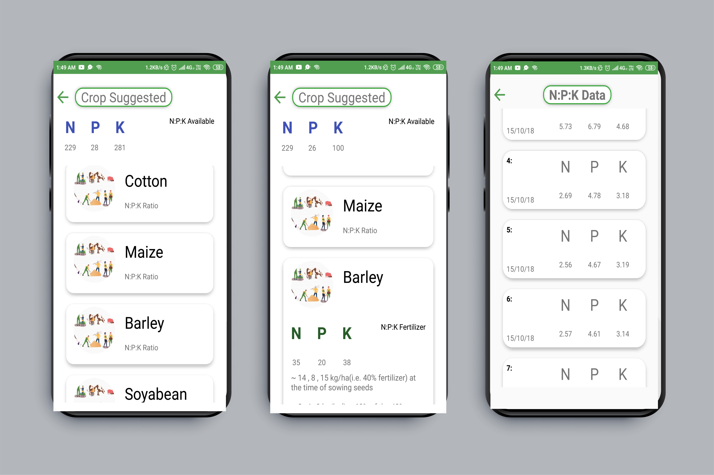
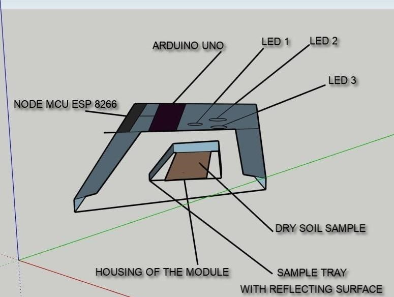
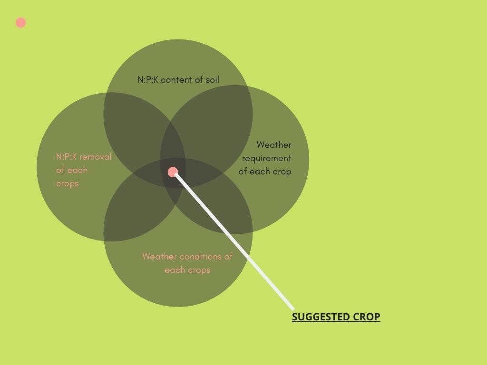
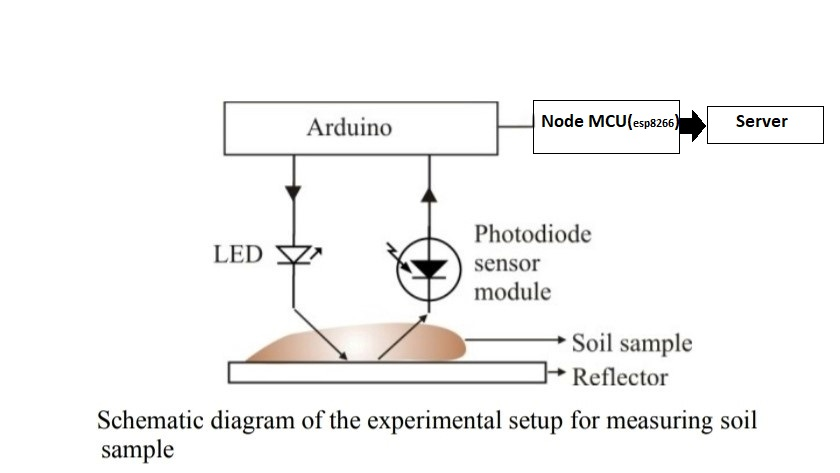
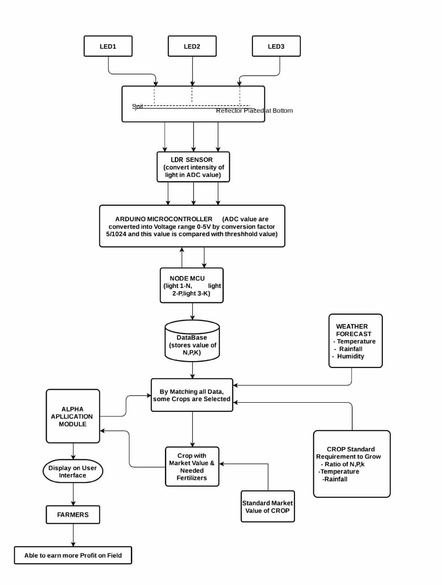

# Alpha-Agriculture-Module
Alpha module helps to estimate the soil fertility status on real time basis and to give advisory on best suitable crop that soil will sustain in coming weather conditions to maximize farmers’ income. This will help in better planning for fertilizer application in crops and maintain soil fertility status.

# Module

# Working 

# Flow Chart

